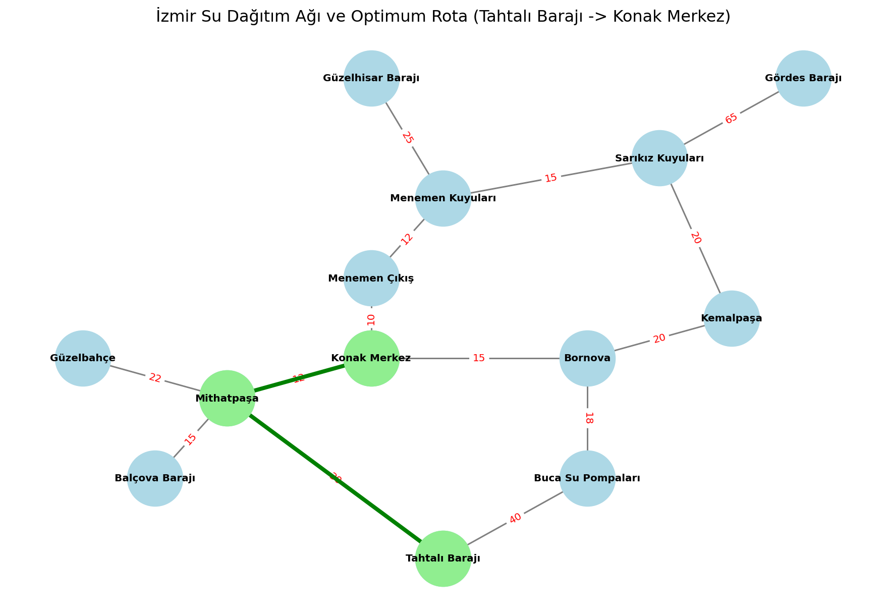

# A-Star Algoritması ile İzmir Su Dağıtım Ağı Optimizasyonu

## Proje Hakkında
Bu proje, Yapay Zekâ dersi kapsamında geliştirilmiştir. Çalışmanın temel amacı, İzmir metropol alanının su dağıtım şebekesini bir arama problemi olarak modellemek ve A* (A-Star) algoritmasını kullanarak suyu en düşük maliyetle hedefe ulaştırmaktır. Günümüzde su kaynakları yönetiminin, mesafe ve yükseklik farkları gibi nedenlerle ciddi bir işletme maliyeti oluşturması problemi, bu çalışmanın çıkış noktasını oluşturmaktadır.

## Problemin Modellenmesi
Optimizasyon süreci için su şebekesi bir graf (graph) yapısı olarak ele alınmıştır. Bu yapı içerisinde su kaynakları, ana depolar ve arıtma tesisleri birer düğüm olarak kabul edilirken, bu merkezler arasındaki boru hatları kenarları temsil etmektedir. Sistemde, kentin ana dengeleme merkezi olan Konak Merkez tüm hatların ulaşması istenen hedef düğüm olarak belirlenmiştir. Başlangıç noktası olarak ise sisteme su sağlayabilen Tahtalı Barajı ve Gördes Barajı olmak üzere iki farklı senaryo üzerinden ilerlenmektedir.

## Maliyet Fonksiyonları ve Algoritma Tercihi
Bu çalışmada hedeflenen şey sadece en kısa yolu bulmak değil, pompalama enerjisi veya altyapı sorunları gibi zorlukları da hesaba katarak en verimli rotayı çizmektir. Algoritmanın karar verme mekanizması iki farklı maliyet fonksiyonuna dayanır. Gerçek maliyet olan g(n), iki düğüm arasındaki işletme zorluklarını ve enerji sarfiyatını içeren kurgusal bir puandır. Sezgisel maliyet olan h(n) ise bulunulan noktadan hedefe olan kuş uçuşu tahmini mesafeyi ifade eder. 

Çözüm için kullanılan A* algoritması, her adımda bu iki maliyeti toplayarak f(n) = g(n) + h(n) formülünü uygular ve en umut verici düğümü seçerek ilerler. Bu yapı, arama işleminin doğrudan hedefe yaklaşan ve aynı zamanda maliyeti en düşük olan yollara öncelik vermesini sağlar.

## Kurulum ve Kullanım
Proje saf Python kullanılarak yazılmış olup herhangi bir dış kütüphane kurulumuna ihtiyaç duymamaktadır. Bilgisayarınızda Python kurulu olduğundan emin olduktan sonra, terminal veya komut satırı üzerinden projenin bulunduğu dizine giderek doğrudan aşağıdaki komutla çalıştırabilirsiniz:

`python code.py`

Uygulama çalıştığında, A* algoritması Tahtalı Barajı ve Gördes Barajı için ayrı ayrı optimizasyon yapacak ve Konak Merkez'e ulaşan en ideal rotaları toplam sistem maliyetleriyle birlikte konsol ekranına yazdıracaktır.
